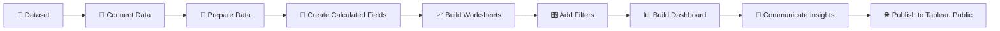
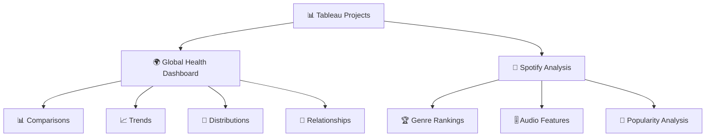

# Tableau Data Visualisation Project – Data Technician Bootcamp

In this repository, I showcase the Tableau workbooks, dashboards and supporting materials I completed during the **Week 2 Tableau module of the Data Technician Bootcamp**.

## 📊 Project Overview

During this project, I used **Tableau** to analyse datasets and transform information into clear, interactive visualisations and dashboards.

I worked with **global health and Spotify music data**, using filters, calculated fields, sorting and different chart types to identify trends, compare categories and investigate relationships.

A major focus of my work was **data storytelling** — using visualisations not simply to display information, but to communicate meaningful findings clearly.

## 🔄 My Tableau Workflow



## 🛠️ Skills I Demonstrated

### 📊 Dashboard Development

I developed practical experience in:

* Creating **interactive Tableau dashboards**
* Combining multiple worksheets
* Designing dashboard layouts
* Applying interactive filters
* Creating dashboards that allow users to explore data dynamically

### 🔎 Data Exploration

I worked with:

* **Dimensions and Measures**
* Filters
* Sorting
* Top N analysis
* Latest-year filters
* Data relationships
* Null value removal
* Category and geographic analysis

### 🧮 Calculated Fields

I created calculated fields to generate:

* New metrics
* Custom calculations
* Business calculations
* Conditional logic
* Derived analytical values

### 📈 Data Visualisation

I created a variety of visualisations, including:

* 📊 **Bar charts** – for comparisons and rankings
* 📈 **Line charts** – for analysing trends over time
* 🥧 **Pie charts** – for distributions and proportions
* 🗺️ **Map charts** – for geographic analysis
* 🔵 **Scatter plots** – for exploring relationships between variables
* 🧩 **Treemaps** – for comparing categories

## 📈 Key Project Activities

### 🌍 Global Health Dashboard

I analysed the **Gapminder Health dataset** to investigate:

* Life expectancy
* Population
* Gender
* BMI
* Cancer incidence
* Geographic differences

I created visualisations showing:

* Life expectancy by continent
* Life expectancy trends over time
* Population distribution by gender
* Life expectancy versus BMI
* Cancer-related patterns across continents

I also added interactive filters so users could explore individual countries and regions.

This project includes an interactive Tableau dashboard exploring global health indicators.


🔗 [View the Global Health Dashboard on Tableau Public](https://public.tableau.com/views/GlabalHealthDashboard/GlobalHealthDashboard?:language=en-GB&publish=yes&:sid=&:redirect=auth&:display_count=n&:origin=viz_share_link)


### 🎵 Spotify Music Analysis

I created a second Tableau dashboard using Spotify data to investigate factors associated with **genre and track popularity**.

I explored characteristics including:

* Energy
* Acousticness
* Speechiness
* Instrumentalness
* Genre
* Popularity
* Artist performance

I used the dashboard to compare popular and less popular genres and investigate whether particular audio characteristics appeared to be associated with popularity.


🔗 [Explore Music Genre Popularity on Tableau Public](https://public.tableau.com/views/Spotify-Task2/ExploringMusicGenrePopularity?:language=en-GB&publish=yes&:sid=&:redirect=auth&:display_count=n&:origin=viz_share_link)

## 🧠 My Dashboard Structure



## 📖 Data Storytelling

I learned that choosing the correct visualisation depends on the question I want to answer.

| Analytical Question | Visualisation I Used |
|---|---|
| Which category performs highest? | 📊 Bar chart |
| How has a metric changed over time? | 📈 Line chart |
| What proportion belongs to each category? | 🥧 Pie chart |
| Where is something located? | 🗺️ Map |
| Is there a relationship between two variables? | 🔵 Scatter plot |

This helped me transform raw datasets into visual stories that could support organisational decision-making.

## 🎯 Learning Outcomes

By completing this project, I developed practical experience in:

* Tableau dashboard development
* Dimensions and Measures
* Calculated Fields
* Interactive filters
* Data relationships
* Sorting
* Top N analysis
* Bar charts
* Line charts
* Pie charts
* Scatter plots
* Map charts
* Treemaps
* Dashboard design
* Data storytelling
* Publishing dashboards to Tableau Public

## 💻 Tools I Used

`Tableau` `Tableau Public` `Calculated Fields` `Interactive Dashboards` `Filters` `Data Analysis` `Data Visualisation` `Data Storytelling`

## 📁 Project Contents

```text
📦 Tableau-Data-Visualisation
 ┣ 🌍 Global Health Dashboard
 ┣ 🎵 Spotify Analysis
 ┣ 📊 Tableau workbook
 ┣ 🖼️ Dashboard screenshots
 ┣ 📁 Supporting datasets
 ┣ 🌐 Tableau Public links
 ┗ 📄 README.md
```
